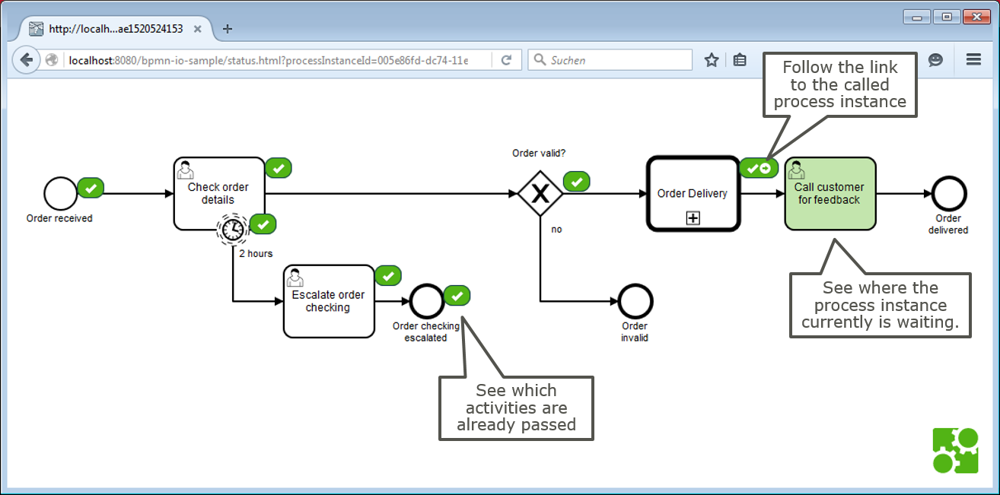

Simple Process Instance Satus View using bpmn.io
=========================

This example consists of a 

* Simple HTML page
* Including bpmn.io libraries and 
* JavaScript code to 
** Load the BPMN XML for agiven Process Instance Id from the Camunda BPM REST API
** Visualizes this in the BpmnJS Viewer
** Loads history information for the Process Instance
** Add Overlays and Markers to the BPMN 2.0, to visualize these information
* This example is a self contained [HTML page](src\main\webapp\status.html), but Maven and WebJars are used in order to build a WAR which can be deployed on a Java container. So no need to fiddle with JavaScript libraries or to include them into the project sources.

== How to use it?

* Build via Maven and Deploy to your container
* Access it via your browser: [http://localhost:8080/bpmn-io-sample/status.html?processInstanceId=xxx](http://localhost:8080/bpmn-io-sample/status.html?processInstanceId=xxx) - replace xxx with the Process Instance Id of the process instance you want to display

== More Use Cases!

You can use this technology to basically display whatever you like on the process model. You could display e.g. information about all process instances of a given process definition or statistics as well.