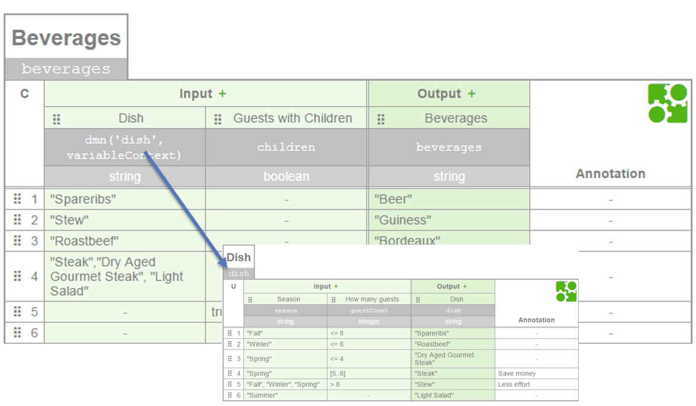

# DMN Decision Chaining Options

**NOTE:** This example is slightly outdated - nowadays one would probably choose to use [DRDs](https://docs.camunda.org/manual/latest/user-guide/dmn-engine/evaluate-decisions/#decisions-with-required-decisions) for chaining decision tables. However, the snippet provides a nice example on how to implement custom functions for DMN.

When you want to evaluate dependant decisions you have basically three options on the Camunda Platform:

Use a **decision flow**: A small BPMN process referencing the decisions as Business Rule Tasks. Make sure that this process is soley a decision flow, meaning it does not contain real business process logic. It is important to keep workflow and decision logic seperated. But you can use BPMN easily to chain decisions on the Camunda BPM Platform.

Use a **custom function** in expression language. Then you can call another DMN table in the background and use the output from there as Input. 

Do the chaining **harcoded in Java** somewhere.

# Decision Flow

Model a normal BPMN process and use Business Rule Tasks. See [Example](dmn-decision-chaining-example/src/main/resources/decision-flow) for details.

# Write Custom Function as Process Engine Plugin

* Write a Process Engine Plugin, e.g. [DmnDecisionChainingPlugin](dmn-decision-chaining-plugin/src/main/java/com/camunda/consulting/DmnDecisionChainingPlugin.java) which registers a
* [DmnDecisionChaniningFunctionMapper](dmn-decision-chaining-plugin/src/main/java/com/camunda/consulting/DmnDecisionChaniningFunctionMapper.java) providing the *dmn('decisionKey', variableContext)* function (please note that we need the VariableContext here)
* and [evaluate the referenced DMN table](dmn-decision-chaining-plugin/src/main/java/com/camunda/consulting/DecisionTableEvaluator.java) by using a bit of internal API in order to directly use the VariableContext.

Best refer to the [Example Testcase](dmn-decision-chaining-example/src/test/java/com/camunda/demo/dmn/chaining/InMemoryH2Test.java) to see everything in action. 

When using in a container please make sure to install the plugin properly, see [User Guide: Process Engine Plugin](https://docs.camunda.org/manual/7.4/user-guide/process-engine/process-engine-plugins/). For WildFly it means for example to add the Java library to the camunda engine module.
