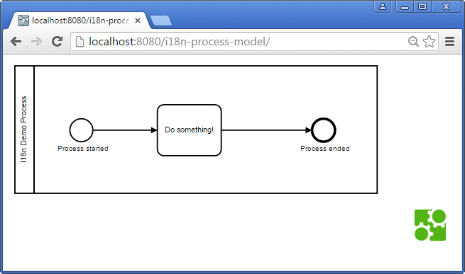

Translate your process model on the fly
=========================

If you have multi-lingual audiences for your process model 
you can

- translate the process model in the BPMN XML and afterwards
- render it using bpmn.io.

This example translates the following process which was modeled using I18N_KEYS:

And looks like this after translation:

How does it work?
--------------

Translations are authored using simple properties files

- [en.properties](xxx)
- [de.properties](xx)

The translation is done by using XPath to find and replace names:

- [ProcessModelTranslator.java](xxx)

This translated BPMN.xml is handed out via a [Simple Servlet](xxx) to have as less environment requirements as possible for the example.
In real-life use REST, JSF or whatever you always use for this job.

Last step is to render the model using bpmn.io:

- [index.html](xxx)

How to use it?
--------------

Build it via Maven and deploy the WAR to your Camunda Installation.

Once you deployed the application access the process model via
[http://localhost:8080/i18n-process-model/](http://localhost:8080/i18n-process-model/).

Environment Restrictions
------------------------

Built and tested against Camunda BPM version 7.3.0.

License
-------

[Apache License, Version 2.0](http://www.apache.org/licenses/LICENSE-2.0).
