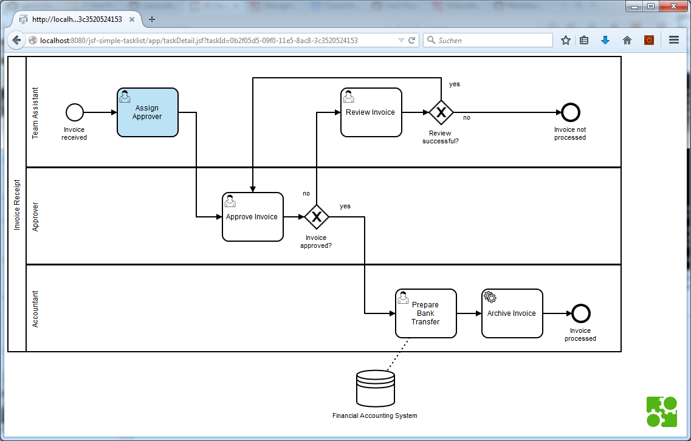

jsf-simple-tasklist
=========================

This is an example for a simple task list build with JSF and CDI. 
You can start new process instances and work on JSF task forms and complete them.

If the process definition has an external form on the start event, it will be used. 
Otherwise the process instance will be started.

You can switch to a detail page with the process diagram, rendered with BPMN.io.

How to use it?
--------------

Deploy this project to your running Camunda JBoss or Wildfly distribution with either `mvn clean jboss-as:deploy` or 
use `ant` to build and deploy the example to an application server.
For that to work you need to copy the file `build.properties.example` to `build.properties`
and configure the path to your application server inside it.
Alternatively, you can also copy it to `${user.home}/.camunda/build.properties`
to have a central configuration that works with all projects generated by the
[Camunda BPM Maven Archetypes](http://docs.camunda.org/latest/guides/user-guide/#process-applications-maven-project-templates-archetypes).

Load [localhost:8080/jsf-simple-tasklist](http://localhost:8080/jsf-simple-tasklist) in your browser.

Display the process diagram
---------------------------

The taskDetail.xhtml is a jsf-Page that simply (and only) renders the process diagram and highlight the current task. 

If you want to include it into your process application, these steps have to be taken:

1. include bpmn-js webjar into your [pom.xml](pom.xml#L129-L133) (see lines 129-133)
2. create a jsf-page which gets the taskid from the tasklist (or wherever). [See line 7-9 taskDetail.xhtml](src/main/webapp/app/taskDetail.xhtml#L7-L9) how to get the taskId.
3. include the bpmn.js cascading style sheet from the webjar [see lines 28-30](src/main/webapp/app/taskDetail.xhtml#L28-L30)
4. include the bpmn-js javascript and all dependent libraries (jquery.js, lodash.js, sax.js, snap.svg.js, jquery.mousewheel.js and bpmn-navigated-viewer.js, [see lines 32-42](src/main/webapp/app/taskDetail.xhtml#L32-L42)
5. define a div with a css class where to drop the diagram [see lines 46-49](src/main/webapp/app/taskDetail.xhtml#L46-L49)
6. include the javascript that renders the diagram. 
  1. define a callback function that the page is loaded ([line 52](src/main/webapp/app/taskDetail.xhtml#L52))
  2. initialize constants to the rest api and the viewer ([lines 53-57](src/main/webapp/app/taskDetail.xhtml#L53-L57))
  3. get the task object from the rest-api of the engine and define a callback function working with this task as marker ([line 59](src/main/webapp/app/taskDetail.xhtml#L59))
  3. get the diagram xml for the task from rest-api the engine and define a callback function working with the diagram as data ([line 60](src/main/webapp/app/taskDetail.xhtml#L60))  
  4. call importXML of the viewer and define a callback function to handle with a possible error [line 63](src/main/webapp/app/taskDetail.xhtml#L63)
  5. if an error occures, write the error to the javascript console [line 64-65 ](src/main/webapp/app/taskDetail.xhtml#L64-L65)
  6. otherwise get the canvas from the viewer, zoom it to the full view, exchange the css class to display the diagram istaed of display the error [lines 66-71](src/main/webapp/app/taskDetail.xhtml#L66-L71)
  7. set a marker to the current task with the task definition key. [line 73](src/main/webapp/app/taskDetail.xhtml#L73). The markup for the highlight is defined in a css part in [line 16-26](src/main/webapp/app/taskDetail.xhtml#L16-L26)
  8. include the cascading style sheet `modeller.css` to display the diagram [lines 81-82](src/main/webapp/app/taskDetail.xhtml#L81-L82)
  

Environment Restrictions
------------------------

Built and tested against Camunda BPM version 7.2.0.

Known Limitations
-----------------

You can not complete tasks with embedded forms.

This project has been generated by the Maven archetype
[camunda-archetype-ejb-war-7.2.1](http://docs.camunda.org/latest/guides/user-guide/#process-applications-maven-project-templates-archetypes).
