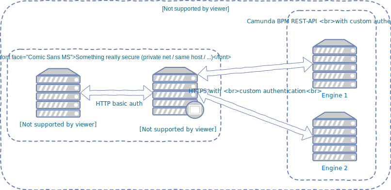

# Camunda Optimize and REST API with custom authentication

Say that you want to use Camunda Optimize together with your installations of Camunda BPM, but you cannot expose the engine's REST-API to the host running Optimize without any additional security. The kind of additional security highly depends on your use case / environment / etc. so we consider that it is some kind of custom HTTP authentication procedure.

Here, we show a very basic setup how you can connect Camunda Optimize to one or more REST-API endpoints that are protected by some custom authentication (that is, anything beyond HTTP basic auth which is supported by Optimize directly). To follow this setup, make sure to understand [how to connect Optimize to Camunda BPM](https://stage.docs.camunda.org/optimize/develop/technical-guide/configuration/#connection-to-camunda-bpm-platform).

The basic idea is to put a proxy in front of Optimize that talks HTTP basic auth to Optimize and custom authentication to REST-API. In this example, we simply use [nginx](http://nginx.org/en/), which has a rich set of features, but one could also more dynamic technology, for example a more dynamic and Java-based approach using [zuul](https://github.com/Netflix/zuul).

Have a look at the architecture overview:


This project implements a simplified version of this architecture using [docker-compose](https://docs.docker.com/compose/overview/). Our [compose file](docker-compose.yml):
- defines two networks:
    - *optimizePrivate*: the private net Optimize and the proxy are running in (it is the left box in the figure above)
    - *company*: the company network that enables access to Camunda engine's REST API
- starts a Camunda Optimize standard installation inside a [docker image](optimize/Dockerfile), which is connected only to *optimizePrivate*
- use an [nginx image](https://hub.docker.com/_/nginx/) to start nginx with [custom configation](proxy.conf), which
    - is connected to *optimizePrivate* AND *company*
    - proxies requests to ```/engineOne``` to the first engine's REST-API
    - proxies requests to ```/engineTwo``` to the second engine's REST-API
    - adds a custom authentication header for all requests to the engines
    - requires HTTP basic authentication for accessing the proxy
- starts two camunda engines with secured REST-API enabled which
    - are based on [Camunda spring boot starter](https://docs.camunda.org/get-started/spring-boot/)
    - use [this lovely spring-security approach](https://github.com/camunda-consulting/code/tree/master/snippets/springboot-security-sso) to provide custom authentication
    - require every incoming request to contain a custom HTTP authentication header
    - are NOT secured by HTTPS, to simplify matters
    - deploy and start a demo process, [Process One](processOne.bmpn) and [Process Two](processTwo.bpmn) respectively

## Try it out

### Prerequisites

- install docker and docker-compose
- put the Camunda Optimize tarball into place
```
cp <my download foler>/camunda-optimize-2.0.0-full.tar.gz ./optimize/camunda-optimize-2.0.0-full.tar.gz
```

### Bring it up

That is simple

```
docker-compose up --build
```

Then wait a couple of seconds to let optimize wait for elastic search and start up.

### Enter license and log in

Go to [local running optimize](http://localhost:8090), enter your license and log in with admin:admin

### Play around

You will see that Optimize is connected to two engines. After initial import is done, try to create some reports and see that there is data for *Process One* and *Process Two*

To check if we are really secure, the setup exopses the proxy as```http://localhost:8080``` and the REST-APIs as ```http://localhost:8081``` (resp. ```http://localhost:8082```). Take [some REST tool](https://www.getpostman.com) to convince yourself that the REST-APIs really expect the custom header ```Custom-Auth-Token: secretOne``` (resp. secretTwo)  .
